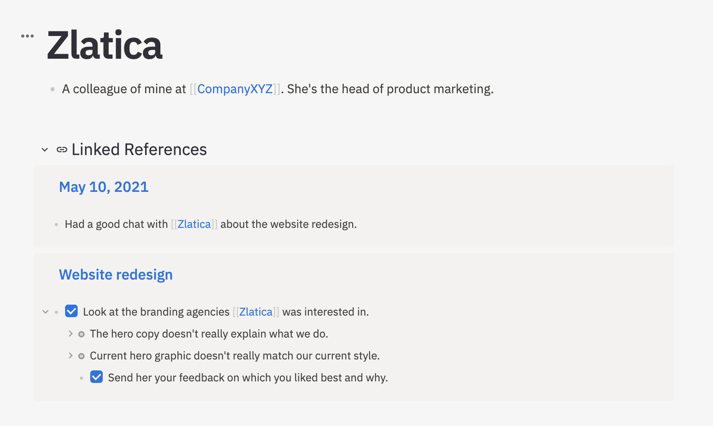

# Bidirectional links

Athens uses **bidirectional links** to help you organize your knowledge graph.

Bidirectional links are a little different from the normal one-way links \(aka "[monolinks](https://maggieappleton.com/bidirectionals)"\) you're used to seeing on the web. Normal links point from A to B, which is great for connecting information or leading readers down a particular path, but they don't help anyone who wants to explore _from B back to A_.

When you create a bidirectional link in Athens, you're creating two pages that are aware of each other. A links to B through what _looks_ like a one-way link, but then B references back to A via a list of references.

### Create links

To create a link, type `[[` in the outliner. A dropdown appears to help you search for an existing page that you want to link to from the current page. 

Move between the items in the dropdown with the up and down arrow keys, then hit `Enter` to select one. Or, click on the appropriate page with your mouse.

If you want to link to a page that doesn't yet exist, finish typing the title you'd like that page to have, then hit `Enter` or `]]` to finish creating the link.

Once you move to the next block on the document, the link syntax turns into a live link, which navigates you directly to that document.


Links also work with either`#`, or `#[[]]` syntax, such as `#Website` or `#[[Website]].` These links function the same, but the outliner renders them in the default text color, and they use a `#` symbol instead of `[[Website]]` symbols.


### Linked References

As mentioned above, the links you create between pages are bidirectional, which means they appear on both "sides" of the link.

On the page being linked to, these links appear in the **Linked References** section, which is below the outliner.

In this example, clicking on the **May 10, 2021** or **Website redesign** links take you directly to those pages.

### Unlinked References

If a page contains a string that matches the title of a page that already exists in your graph, Athens adds this to the **Unlinked References**.

For example, here's an unlinked reference to the **Zlatica** page from another page.

You can leave this unlinked, or you can click the **Link** button to automatically wrap the string in the link syntax and create a new bidirectional link.

